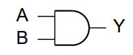
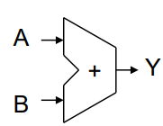
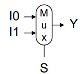
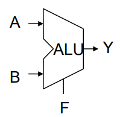
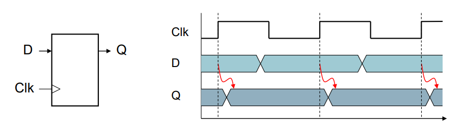
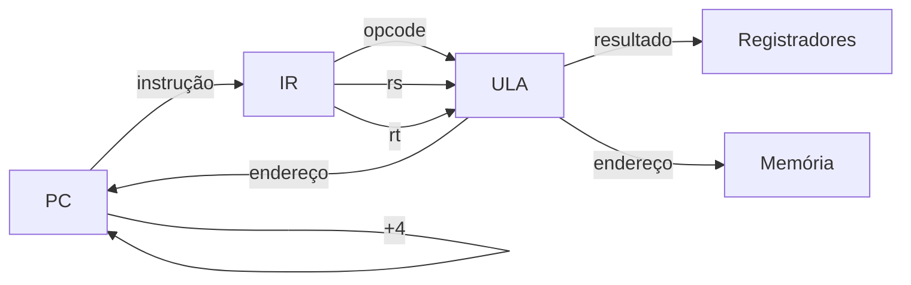

[Voltar à página inicial](../README.md#sumário)

# Arquitetura de um processador
> Caminho de dados de um processador  
> Implementação de um processador Mips

## Execucação de uma instrução

Ciclo Fetch :arrow-right: Decode :arrow-right: Execute

- PC: acesso a memória de instruções, obtém a instrução (fetch)
- Decodifica a instrução e obtém os dados necessários para a execução (decode)
    - Acesso aos registradores
- Dependendo da classe da instrução:
    - Usa uma ULA para cálculos:
        - Instruções aritméticas: resultado da operação
        - Instruções de acesso à memória: cálculo do endereço
        - Instruções de desvio: endereço do desvio
    - Faz acesso à memória
    - PC :arrow-left: destino do desvio ou PC + 4

## Controle
- Informações codificada em binário (0 para voltagem baixa e 1 para alta voltagem)

### Elementos Combinacionais
> Operam com os dados e a saída é uma função da entrada
- Porta AND: Y = A & B  

- Somador: Y = A + B  

- Multiplexador: Y = S ? I1 : I0  

- Unidade Lógica Aritmética (ULA): Y = F(A,B)  

### Elementos Sequenciais
> Armazenam informações <!--e a saída depende da entrada e do estado atual-->

- Registrador:
    - armazena um valor
    - usa um clock para atualizar o valor
    - atualiza o valor na borda de subida do clock
    

... aula 29/11 slide aula 3  
stall / bolhas são os tempos de ociosidade do processador

## Tabela da controladora

| | Tipo R | lw | sw | beq | 
| :---: | :---: | :---: | :---: | :---: |
| RegDst | 1 | 0 | X | X |
| ALUsrc | 0 | 1 | 1 | 0 |
| MemRead | 0 | 1 | 0 | 0 |
| MemWrite | 0 | 0 | 1 | 0 |
| MemToReg | 0 | 1 | X | X |
| Branch | 0 | 0 | 0 | 1 |
| RegWrite | 1 | 1 | 0 | 0 |

