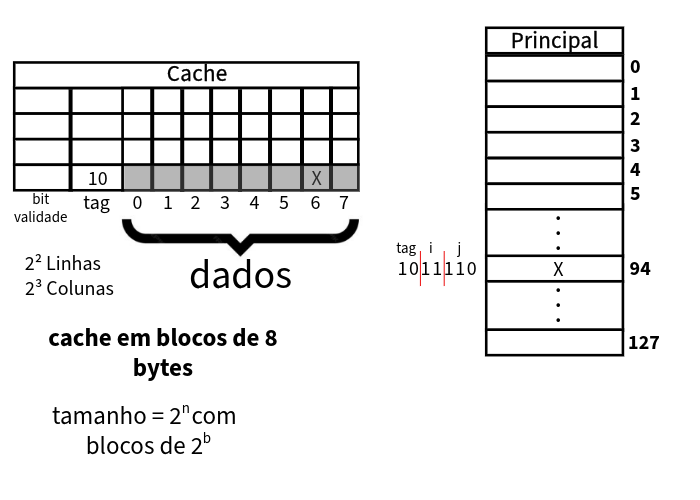
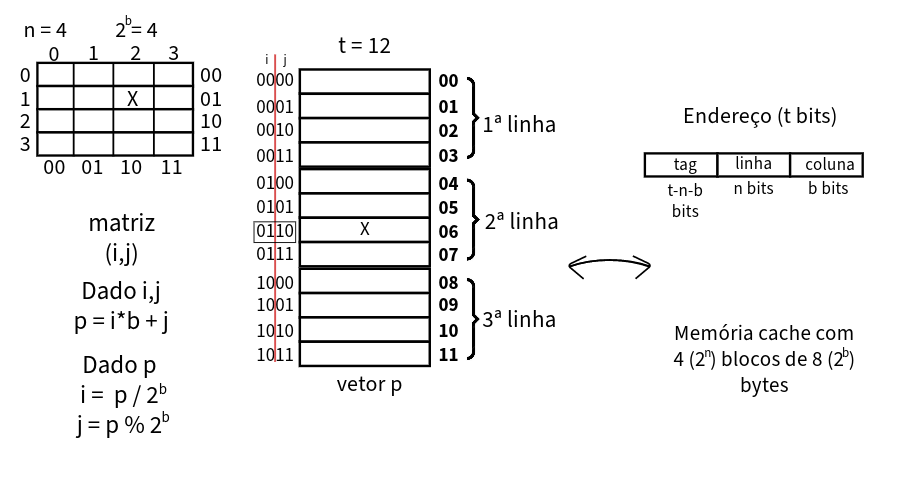

[Voltar à página inicial](../README.md#sumário)
# Hierarquia de Memória
No computador, a memória é responsável pelo armazenamento de dados e programas, e deve atender demandas do processador.

O acesso à memória é a etapa mais lenta no processamento, comprometendo o desempenho do computador como um todo.

Tecnologias de memória têm sido alvo de constante pesquisa e desenvolvimento tecnológico, entretanto novas tecnologias costumam possuir um custo muito alto, o que compromete seu uso em computadores pessoais.

Para obter um **trade-off** entre custo e desempenho, o sistema de memória é organizado de maneira hierárquica.

Essa organização hierárquica consiste no emprego de tecnologias da seguinte forma:
- quanto mais rápida, mais próxima do processador e menor a quantidade (para diminuir o custo)

Desta forma, os dados são armazenados no nível mais baixo, e trafegam somente entre níveis adjacentes conforme demanda do processaor. Para otimizar este tráfego, o armazenamento e lógica de requisições, seguem duas premissas chamadas **princípios de localidade**:
1. **localidade temporal**: um dado requisitado tende a ser requisitado novamente
2. **localidade espacial**: se um dado foi requisitado, dados em sua vizinhança tendem a ser requisitados

Quando o processador requisita um dado, se ele estiver no nível 1, dizemos que houve um **acerto**. Caso contrário, dizemos que houve uma **falha**. 

A **taxa de acerto (falha)** é a quantidade relativa de requisições que resultaram em **acerto (falha)**.

A **penalidade de falha** é o tempo que o sistema de memória demora para carregar o dado no nível 1. O objetivo da organização hierárquica é minimizar a taxa

Em um computador genérico:
- nível 1 é a memória cache
- nível 2 é a memória ram
- nível 3 é o disco (HD, SSD, etc)

## Memória Cache
Quando o processador requisita um dado, ele referencia um endereço de memória do dado que dizemos endereço da **memória principal**. A memória principal é uma abstração oferecida pelo sistema operacional (pode ser a RAM, a RAM + disco, a RAM + swap, etc).

A ideia da memória cache é armazenar cópias dos dados da memória principal de forma a **minimizar a taxa de falhas** atendendo da melhor forma os princípios de localidade.

### Mapeamento direto
O mapeamento direto é a forma mais simples de implementar uma memória cache. Neste tipo de mapeamento, cada endereço da memória principal é mapeado em um endereço da memória cache.

 
Tamanho da principal: $2^t$  
Tamanho da cache: $2^n$

Endereço (t bits)

| tag | linha |
| :--: | :--: |
| t-n bits | n bits |

>OBS sobre o bit da validade: se o o bit for 0, o bloco de dados é inválido, se for 1, o dado é válido

Considerando uma memória cache com $2^n$ blocos de $2^b$ bytes, e uma memória principal com $2^t$ bytes, a memória cache deverá ter tamanho:

Tamanho real (em bit) = Qtde de blocos (adimensional) * [1 + tamanho da tag + tamanho do bloco] (em bit)
 

**Exemplo:** Qual o tamanho real de uma cache diretamente mapeada, que suporta 16 KiB em blocos de 32 bytes, para uma memória principal de 4 GiB?

1. Quantidade de blocos: $\frac{16KiB}{32B} = \frac{2^4 \times 2^{10}}{2^5}\times\frac{B}{B} = 2^{9}$ blocos
2. Tamanho da tag: = $t-n-b$  
bloco = 32B = $2^5$B, então $b=5$, n=9. Logo, tag = 32-9-5 = 18

Tamanho real = $2^9 \times [1 + 18 + 32 \times 8] = 2^9 \times 275\text{ bits} = \frac{2^9\times275}{2^3} = 275\times2^6\text{ B} = \frac{2^6\times275}{2^{10}} = 17,1875 \text{ KiB}$

>Kib = $2^{10}$