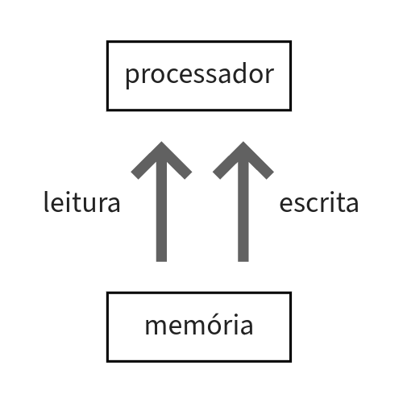

O processador tem 32 registradores, 18 deles livres para uso
Quando os dados não cabem nos registradores, o precessador acessa a memória principal (e a memória principal fica responsável por gerenciar as outras memórias/ unidades - cash, disco, etc)
Só existem duas requisições que o processador faz para a memória:  

# Instruções de acesso à memória

| | Memória Principal |
| :--:| :--: |
| ... | |
| 4 | |
| 3 | |
| 2 | |
| 1 | |
| 0 | |

Cada célula tem um 1 byte. Um inteiro, por exemplo, que tem 4 bytes, ocupa 4 células <strike>e o endereço de memória desse número aponta sempre para o início do inteiro</strike>

*1 B = 8 bits*  
*1 KiB = 2^10 B = 2^13 bits*  
*1 MiB = 2^10 KiB = 2^20B*  
*1 GiB = 2^10 MiB = 2^20KiB = 2^30B*  
*Obs: KB = 1000 e KiB = 1024*


A função `sw reg1, const(reg2)` (store word - escrita) salva o conteúdo de reg1 na memória, no endereço reg2 + const  
*Obs: reg2 é o endereço base*  
A função `lw reg1, const(reg2)` (load word - leitura) lê o conteúdo da memória do endereço reg2 + const e salva e reg1  

Obs: Os dados sempre são salvos em endereços múltiplos de 4. Isso se chama **restrição de alinhamento**  
Obs2: Para utilizar as instruções de acesso à memória, o espaço na memória deve estar alocado. Há duas formas de alocar espaço na memória:  
* Declarações em `.data`
* `sycall 9`

### Exemplo 1
Considerando o seguinte código em C
```c
int main(){
    int g,h,A[10];
    ...
    g = h + A[8];

}
```
g em `$s0`, h em `$s1` e endereço base de A em `$s2`  
*Obs: o endereço base é o onde começa o dado. Nesse exemplo o endereço base aponta para o A[0]*  

Primeiro precisamos carregar o valor de A[8] para depois realizar a soma
```asm
lw $t0, 32($s2) # 32 = 4*8 (deslocamento)
add $s0,$s1,$t0 # g = h + A[8]
```

### Exemplo 2
Considerando o seguinte código em C
```c
int main(){
    int h,A[15];
    ...
    A[12] = h + A[8];

}
```
A solução fica:
```asm
lw $t0, 32($s2) # 32 = 4*8 (deslocamento)
add $s0,$s1,$t0 # s0 = h + A[8]
sw $s0, 48($s2)
```
Outra solução (economizando registradores) é:
```asm
lw $t0, 32($s2) # 32 = 4*8 (deslocamento)
add $t0,$s1,$t0 # s0 = h + A[8]
sw $t0, 48($s2)
```
# Sistema numérico
**Posicional:**
Nosso sistema numérico é posicional. Exemplo
| C | D | U |
| :-: | :-: | :-:
| 1 | 0 | 0 |

O mesmo símbolo possui valores distintos a depender da posição que ocupa

**Possui base:**
Quantidade de símbolos para representação 

Considerando o número  
X = Xn-1 Xn-2 ... X2 X1 X0

Considerando uma base b:  
X = Xn-1 * b^(n-1) + Xn-2 * b^(n-2) + ... + X2 * b² + X1 * b¹ + X0 * 1  

Exemplo: 101001 na base 2  
X = 1*2^5 + 0*2^4 + 1*2^4 + 0*2^3 + 0*2^2 + 0*2^1 + 1*2^0
## Representação de sinal (binário)
### Complemento de 2
| | 0 | 0 | 1 | 0 | 1 | 0 | 1 |
| :-: | :-: | :-: | :-: | :-: | :-: | :-: | :-:
| | 1 | 1 | 0 | 1 | 0 | 1 | 0 |
| + | ||||||1
| | 1 | 1 | 0 | 1 | 0 | 1 | 1 |
### Bit de sinal
Se o bit mais significativo for 0, o número é positivo. Se o bit mais significativo for 1, o número é negativo
### Exercício
Relembrar outras formas de representação de números com sinal, em particular:
* bit de sinal (magnitude)
* complemento a 1
* excesso
